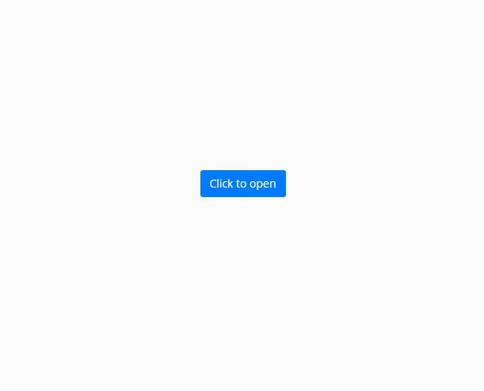
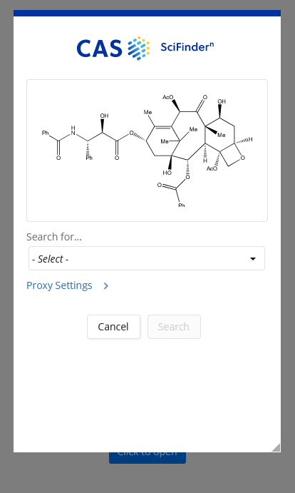
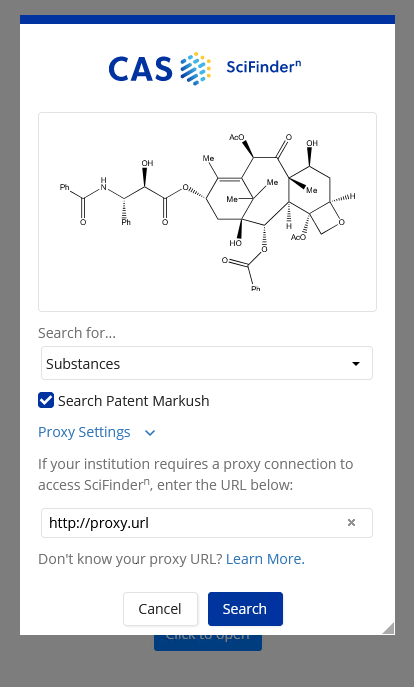

# Deploy locally

Tested with Node v14.17.1 (npm 6.14.13).
You can run `node-npm-install.sh` to ensure you have the correct versions.

1. Clone the repo and navigate to this directory.
2. Install dependencies (`npm install`).
3. Build the Angular client (`npm run build`).
4. Run the Angular development server (`npm run start`).

You can then view the application at http://localhost:4201/


# Potential issues

If you encounter the following error whilst attempting `npm install`
```
gyp ERR! build error 
gyp ERR! stack Error: `make` failed with exit code: 2
gyp ERR! stack     at ChildProcess.onExit (/home/mwr29/repos/scifinder-n-api/sample-code/node_modules/node-gyp/lib/build.js:262:23)
gyp ERR! stack     at ChildProcess.emit (events.js:375:28)
gyp ERR! stack     at Process.ChildProcess._handle.onexit (internal/child_process.js:277:12)
gyp ERR! System Linux 3.13.0-117-generic
gyp ERR! command "/home/mwr29/.node/bin/node" "/home/mwr29/repos/scifinder-n-api/sample-code/node_modules/node-gyp/bin/node-gyp.js" "rebuild" "--verbose" "--libsass_ext=" "--libsass_cflags=" "--libsass_ldflags=" "--libsass_library="
gyp ERR! cwd /home/mwr29/repos/scifinder-n-api/sample-code/node_modules/node-sass
gyp ERR! node -v v14.17.1
gyp ERR! node-gyp -v v3.8.0
gyp ERR! not ok 
Build failed with error code: 1
```
then you may need to re-install node-gyp:
1. Remove your current node-gyp installation (`rm -rf ~/.node-gyp`).
2. Install node-gyp (`npm i -g node-gyp`, this may require `sudo` depending on your system).
3. Remove the partly downloaded dependencies (`rm -rf node_modules`).
4. Clear your NPM cache (`npm cache clean --force`).

You should then be able to run `npm install` once more.


# Files of interest

* `src/app/modal.component.html` - HTML code
* `src/app/modal.component.less` - styles
* `src/assets` - fonts, images and global styles


# Screenshots

**NOTE: The grab handle in the bottom right-hand corner of the modal is NOT part of the original design. It is intended to simulate the grab handle that would be present on a native desktop window.**







